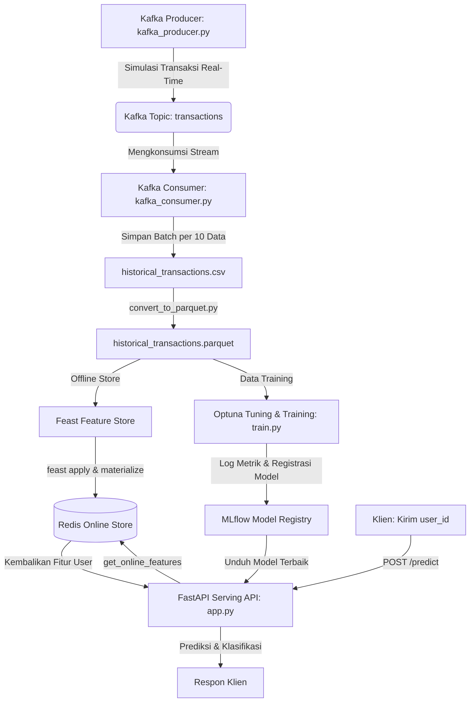

# 🛡️ End-to-End Real-Time Fraud Detection MLOps Pipeline

Proyek ini adalah portofolio sistem produksi **MLOps (Machine Learning Operations)** berskala *enterprise* untuk mendeteksi transaksi *fraud* (penipuan) secara *real-time*. Arsitektur ini dirancang untuk mengintegrasikan seluruh siklus hidup model pembelajaran mesin, mulai dari pengaliran data (*data streaming*), penyimpanan fitur (*feature store*), pelacakan eksperimen (*experiment tracking*), manajemen model (*model registry*), hingga penyajian model secara otomatis (*automated model serving*) di dalam ekosistem **Docker**.


---

## Dashboard Preview


## 🏗️ Arsitektur Sistem

Sistem ini dibangun menggunakan pendekatan *microservices* terdistribusi yang terintegrasi secara *low-latency*. Alur data dan komponen sistem diilustrasikan dalam diagram berikut:



### Penjelasan Alur Komponen:
1. **Data Stream Layer (Apache Kafka & ZooKeeper):** Mensimulasikan dan mengalirkan data transaksi masuk secara *real-time* untuk meniru perilaku transaksi dunia nyata.
2. **Feature Store Layer (Feast & Redis):** Mengelola konsistensi fitur agar tidak terjadi *train-serving skew*. Data historis disimpan dalam format kompresi tinggi (**Parquet**) sebagai *Offline Store*, sedangkan **Redis** bertindak sebagai *Online Store* untuk penyajian fitur dengan latency milidetik.
3. **Tracking & Registry Layer (MLflow & Optuna):** Mengoptimasi *hyperparameter* LightGBM secara otomatis menggunakan Optuna dan melacak hasil eksperimen serta mendaftarkan model terbaik ke MLflow Model Registry.
4. **Serving Layer (FastAPI):** Menyediakan endpoint REST API `/predict` yang menerima request `user_id`, mengambil fiturnya secara instan dari Redis, dan melakukan inferensi model LightGBM secara real-time.

---

## 📁 Struktur Direktori

```text
fraud-detection-mlops/
├── config/
│   └── feast_feature_store/
│       ├── data/                   # DB Registry lokal Feast
│       ├── feature_store.yaml      # Konfigurasi penyambungan Redis & Offline Store
│       └── features.py             # Definisi Entitas & Feature View Feast
├── data/
│   ├── historical_transactions.csv # Data mentah hasil tangkapan Kafka Consumer
│   └── historical_transactions.parquet # Sumber data Offline Store Feast (terkompresi)
├── src/
│   ├── data_stream/
│   │   ├── kafka_consumer.py       # Menangkap stream transaksi dan menyimpan ke CSV
│   │   └── kafka_producer.py       # Mensimulasikan pengiriman transaksi finansial
│   ├── training/
│   │   └── train.py                # Hyperparameter tuning (Optuna) & tracking (MLflow)
│   └── serving/
│       └── app.py                  # API Serving FastAPI dengan integrasi Feast & MLflow
├── convert_to_parquet.py           # Utilitas konversi CSV ke Parquet untuk Feast
├── docker-compose.yml              # All-in-One Orchestration Stack
├── dockerfile                      # Blueprint Docker Image Python
├── requirements.txt                # Dependensi pustaka Python
└── test_feature_retrieval.py       # Skrip pengujian pembacaan online feature store (Redis)
```

---

## 🛠️ Teknologi yang Digunakan

*   **Penyajian API:** [FastAPI](https://fastapi.tiangolo.com/) & [Uvicorn](https://www.uvicorn.org/) (High-performance ASGI server)
*   **Feature Store:** [Feast (v0.64.0+)](https://feast.dev/) & [Redis (v7.0)](https://redis.io/)
*   **Data Streaming:** [Apache Kafka](https://kafka.apache.org/) & [Apache ZooKeeper](https://zookeeper.apache.org/)
*   **Machine Learning:** [LightGBM](https://lightgbm.readthedocs.io/) & [Scikit-Learn](https://scikit-learn.org/)
*   **Optimasi & Tracking:** [MLflow](https://mlflow.org/) & [Optuna](https://optuna.org/)
*   **Containerization:** [Docker](https://www.docker.com/) & [Docker Compose](https://docs.docker.com/compose/)

---

## 🚀 Panduan Memulai (Quick Start)

### 📋 Prasyarat
Sebelum memulai, pastikan sistem Anda telah memiliki:
*   [Docker Desktop](https://www.docker.com/products/docker-desktop/) terinstal dan berjalan.
*   [Python 3.11+](https://www.python.org/downloads/) terinstal di lokal (untuk menjalankan eksperimen secara lokal).

---

### Langkah 1: Persiapan Repositori & Dependensi Lokal
Kloning repositori ke mesin lokal Anda dan instal dependensi jika ingin mencoba eksekusi skrip lokal:
```bash
git clone https://github.com/fahrilalfariziii/Machine-Learning-Portfolio.git
cd "Other Projects/fraud-detection-mlops"

# Membuat Virtual Environment (Opsional namun disarankan)
python -m venv venv
source venv/bin/activate  # Untuk Linux/macOS
# atau
venv\Scripts\activate     # Untuk Windows

# Instal Dependensi
pip install -r requirements.txt
pip install feast redis pyarrow  # Dependensi tambahan untuk Feature Store lokal
```

---

### Langkah 2: Menjalankan Infrastruktur All-in-One (Docker Stack)
Gunakan Docker Compose untuk membangun image dan menyalakan Kafka, Redis, MLflow Server, serta FastAPI secara bersamaan:

```bash
docker-compose up --build
```
> [!NOTE]
> Tunggu hingga terminal menampilkan log `🚀 Model sukses dimuat!` dari container `fraud-serving-api`. Ini menunjukkan bahwa API siap melayani permintaan inferensi.

---

### 📊 Alur Kerja Pipa MLOps (Eksekusi Manual)

Jika Anda ingin menjalankan setiap fase pipa data dan pelatihan model secara manual, ikuti panduan langkah demi langkah berikut:

#### 1. Simulasi Aliran Data (Real-Time Ingestion)
Jalankan consumer terlebih dahulu di satu terminal untuk menangkap data, lalu jalankan producer di terminal terpisah:
```bash
# Terminal 1: Jalankan Consumer
python src/data_stream/kafka_consumer.py

# Terminal 2: Jalankan Producer untuk mulai mengirim data
python src/data_stream/kafka_producer.py
```
Biarkan berjalan selama minimal 10-20 detik agar data transaksi tersimpan di file `data/historical_transactions.csv`, lalu tekan `Ctrl+C` pada kedua terminal untuk menghentikan.

#### 2. Konversi Data ke Parquet
Feast mewajibkan format file terkompresi dengan tipe data timestamp yang valid. Jalankan skrip konversi:
```bash
python convert_to_parquet.py
```

#### 3. Registrasi & Materialisasi Fitur ke Redis (Feast Store)
Masuk ke direktori Feast, daftarkan definisi fitur ke registry lokal, lalu lakukan materialisasi (push data offline ke Redis Online Store):
```bash
cd config/feast_feature_store
feast apply
# Lakukan materialisasi fitur (sesuaikan rentang waktu sesuai data Anda)
feast materialize 2026-06-20T00:00:00 2026-06-27T00:00:00
cd ../..
```

#### 4. Uji Ambil Fitur Online (Redis)
Untuk memastikan data fitur berhasil masuk ke Redis, jalankan skrip pengujian:
```bash
python test_feature_retrieval.py
```

#### 5. Eksperimen Training & Optimasi Model
Jalankan pelatihan model LightGBM yang diintegrasikan dengan hyperparameter tuning otomatis menggunakan Optuna:
```bash
python src/training/train.py
```
Skrip ini akan mencari parameter terbaik, melatih model final, lalu mendaftarkan model tersebut ke MLflow Model Registry.

---

## 🧪 Pengujian Real-Time Inference (API Request)

Setelah seluruh service di Docker Compose aktif, Anda dapat langsung mengirim permintaan prediksi menggunakan `curl`, Postman, atau Insomnia.

*   **Endpoint:** `POST http://localhost:8000/predict`
*   **Headers:** `Content-Type: application/json`

### Contoh Payload Request (JSON):
```json
{
  "user_id": "user_8801"
}
```

### Perintah Uji via Terminal (curl):
```bash
curl -X POST http://localhost:8000/predict \
     -H "Content-Type: application/json" \
     -d '{"user_id": "user_8801"}'
```

### Respon Sukses (JSON):
```json
{
  "user_id": "user_8801",
  "features_retrieved": {
    "amount": 425.5,
    "location": "Jakarta",
    "device_type": "mobile"
  },
  "fraud_probability": 0.0214309,
  "is_fraud": 0
}
```

---

## 📈 Hasil Eksperimen & Performa Model

Berdasarkan pencarian otomatis menggunakan **Optuna** selama 10 kali percobaan dan pelacakan riwayat eksperimen di dashboard **MLflow**, model final **LightGBM** berhasil mencapai performa evaluasi sebagai berikut:

*   **AUC Score:** `0.9783` (Kemampuan pemisahan kelas fraud yang sangat kuat dan presisi)
*   **F1-Score:** `0.8571`

---

## 🖥️ Dashboard Akses Pemantauan

Anda dapat memantau visualisasi metrik dan dokumentasi interaktif API melalui port berikut:
*   **Dashboard MLflow Tracking:** [http://localhost:5000](http://localhost:5000) (Untuk memantau metrik pelatihan, hyperparameter tuning, dan mengunduh model artifact)
*   **FastAPI Swagger UI Docs:** [http://localhost:8000/docs](http://localhost:8000/docs) (Untuk melakukan testing endpoint `/predict` secara interaktif lewat web browser)